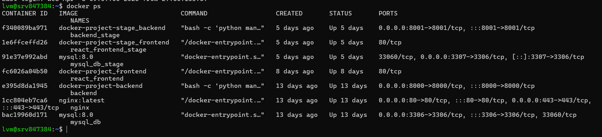
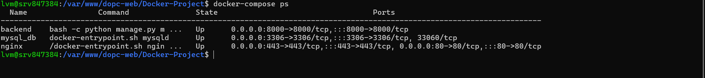
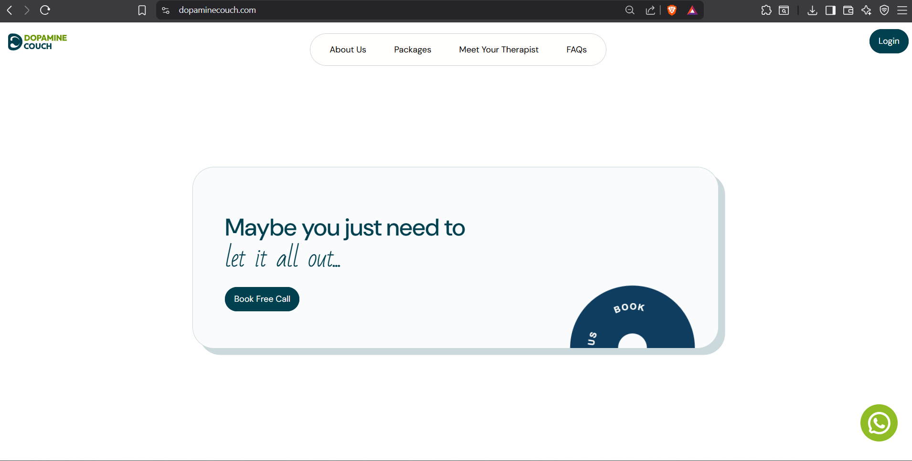
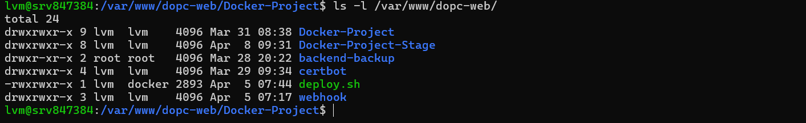
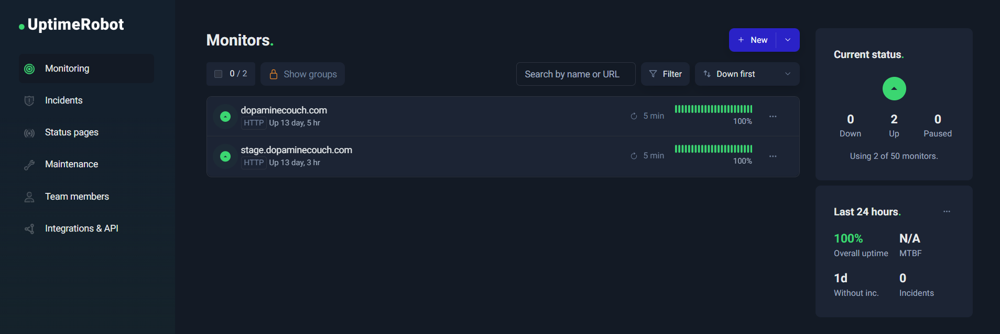

# 🚀 Dopamine Couch - DevOps Infrastructure

## 📌 Overview

This repository contains the production-grade DevOps infrastructure used to deploy and manage the **Dopamine Couch** application on a VPS.

The setup demonstrates real-world DevOps practices including containerization, reverse proxy configuration, environment separation, and deployment automation.

---

## 🏗️ Architecture

```
User → NGINX (Reverse Proxy) → Application Containers
                                ├── Backend (Django)
                                ├── Frontend (Node / Static)
                                └── MySQL Database
```

---

## ⚙️ Tech Stack

* Docker & Docker Compose
* NGINX (Reverse Proxy)
* MySQL 8.0
* Linux (VPS - Hostinger)
* Let's Encrypt (SSL)

---

## 📂 Project Structure

```
.
├── docker-compose.yml
├── nginx/
│   └── nginx.conf
├── scripts/
│   ├── deploy.sh
│   ├── logs.sh
│   └── backup.sh
├── screenshots/
├── .env.example
└── README.md
```

---

## 🌍 Environments

| Environment | Path                                   |
| ----------- | -------------------------------------- |
| Production  | /var/www/dopc-web/Docker-Project       |
| Staging     | /var/www/dopc-web/Docker-Project-Stage |

* Separate environments ensure safe testing and deployment workflows
* Same architecture replicated across environments

---

## 🐳 Containerization

### Docker Compose

Used to orchestrate multi-container services:

* Backend (Django)
* Frontend (Node / Static via NGINX)
* MySQL Database
* NGINX Reverse Proxy

### Key Features

* Multi-service orchestration
* Isolated containers
* Easy scaling and rebuilding

---

## 🌐 NGINX Reverse Proxy

* Routes external traffic to internal services
* Handles HTTP/HTTPS traffic
* Acts as entry point to the system

---

## 🔍 Proof of Deployment

### 🐳 Running Containers



### ⚙️ Docker Compose Services



### 🌐 Live Application via NGINX



### 📂 Project Structure (Prod & Staging)



---

## ⚙️ Automation Scripts

### 🚀 Deployment

```bash
./scripts/deploy.sh
```

### 📜 Logs Monitoring

```bash
./scripts/logs.sh
```

### 💾 Database Backup

```bash
./scripts/backup.sh
```

These scripts simplify deployment, monitoring, and backup operations in production.

---

## 🔐 Environment Variables

Sensitive values are not included in this repository.

Example:

```
DB_NAME=your_db
DB_USER=your_user
DB_PASSWORD=your_password
SECRET_KEY=your_secret
ALLOWED_HOSTS=your_domain
```

---

## 🚀 Deployment Flow

1. Code updated on server
2. Run deployment script or docker-compose
3. Containers rebuilt and restarted
4. NGINX routes traffic to services
5. Application becomes live

---


## 📊 Monitoring & Alerting

Uptime monitoring is implemented using UptimeRobot to ensure high availability of both production and staging environments.

### Features
- HTTP monitoring for production and staging domains
- 5-minute interval health checks
- Real-time uptime tracking
- Instant alerting on downtime

### Monitored Services
- Production: https://dopaminecouch.com
- Staging: https://stage.dopaminecouch.com

### 📸 Monitoring Dashboard


---

## 💡 My Role

* Designed and managed production & staging environments
* Dockerized backend, frontend, and database
* Configured NGINX reverse proxy for routing
* Managed SSL setup using Let's Encrypt
* Handled deployment and container orchestration
* Implemented automation scripts for deployment and monitoring
- Implemented uptime monitoring and alerting using UptimeRobot
- Ensured high availability with continuous health checks
- Configured monitoring for both production and staging environments
---

## ⚠️ Notes

* Sensitive data has been removed and replaced with placeholders
* This repository represents infrastructure only (not full application code)

---

## 👨‍💻 Author

**Lezin VM**
AWS Certified Solutions Architect – Associate
DevOps & Cloud Engineer
